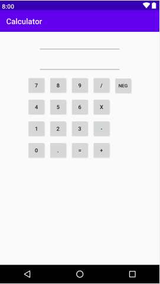
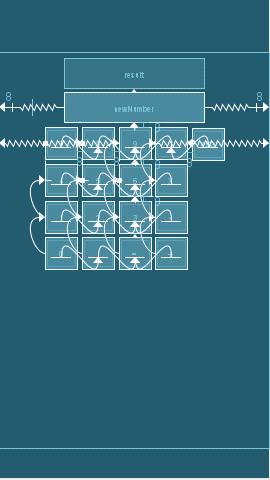
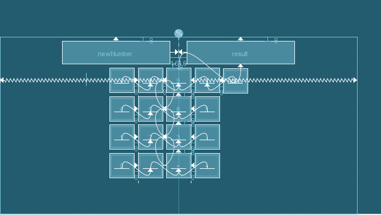

# Simple Calculator App
I created a simple and easy to use calculator app for Android smart phones. I made this project in Android Studio and coded it with Java. My main purpose of this project was to practice getting used to the new Android Studio enviornment as there have been several updates to it since I've last downloaded it. 

# How To Download App
I have provided an APK file so it's easy for Android users to easily download the app. The APK is app-debug[1].apk
Download it on your Android phone and you'll be able to access the calculator app. 

# Repository Contents
- MainActivity.java contains all the logic for my program including object-orientated programming, conditional statement use, functions, as well as try catch statements. 
- layout/activity_main.xml contains all the xml design code for my portrait mode of the app.
- land/activity_main.xml contains all the xml design code for the landscape version of my app. 

# App Platform

 

