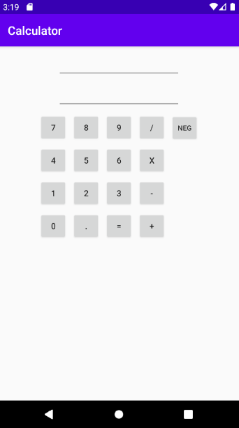
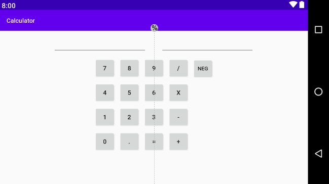

# Simple Calculator App
To practice Java and Android Studio at the same time, I decided to create a simple and easy to use calculator app for my phone.

# How To Download App
I have provided an APK file so it's easy for Android users to easily download the app. The APK is app-debug[1].apk
Download it on your Android phone and you'll be able to access the calculator app. 

# App Platform

 
